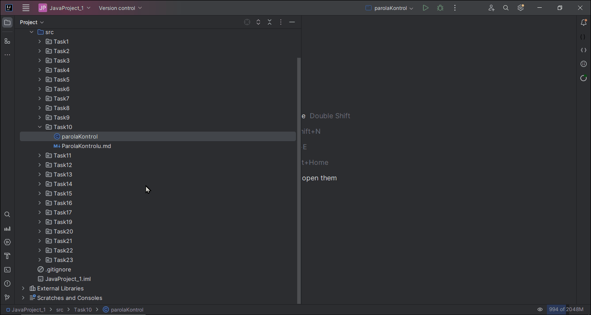

# Güçlü Parola Kontrol Programı

Bu alıştırmada, bir parolanın güçlü olup olmadığını belirleyen bir işlev yazacaksınız. 
Bu uygulamada güçlü bir şifre, en az 8 karakter uzunluğunda, en az bir büyük harf, en az bir küçük harf, 
en az bir rakam ve en az bir özel karakter içeren bir şifre olarak tanımlanmaktadır. 
Kullanıcıdan bir şifre okuyan ve şifrenin güçlü olup olmadığını bildiren bir program geliştirmeniz beklenmektedir.

## Program Açıklaması

1. **Güçlü Parola Kontrol İşlevi:**
    - İşlev, kullanıcının girdiği şifreyi alacak ve şifrenin güçlü olup olmadığını kontrol edecektir.
    - Şifre en az 8 karakter uzunluğunda olmalıdır.
    - Şifre en az bir büyük harf, bir küçük harf, bir rakam ve bir özel karakter içermelidir.
    - Özel karakterler, `! @ # $ % ^ & * ( ) _ + - = { } [ ] ; : ' , < . > / ?` karakterleri arasından seçilmelidir.
    - Şifre güçlü ise `true`, değilse `false` döndürür.

2. **Ana Program:**
    - Kullanıcıdan bir şifre alın.
    - Güçlü parola kontrol işlemini çağırarak şifrenin güçlü olup olmadığını kontrol edin.
    - Sonucu kullanıcıya bildirin.

## Tasarım İpuçları

- Java'da karakterlerin büyük harf, küçük harf, rakam ve özel karakter olup olmadığını kontrol etmek için `Character` sınıfının 
- metotlarını kullanabilirsiniz.
- İsterseniz regex (Regular Expression) kullanabilirsiniz.
- Şifre uzunluğunu kontrol etmek için `length()` metodunu kullanabilirsiniz.
- `Scanner` sınıfını kullanarak kullanıcıdan şifre girişi alabilirsiniz.

